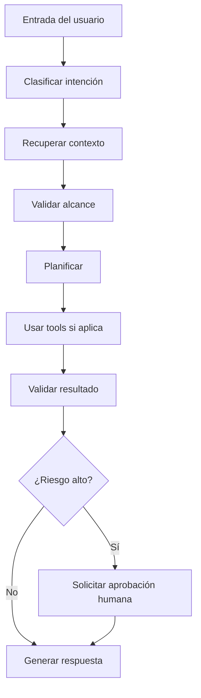

# Agent Design Standard

## 1. Identificación

| Campo | Descripción |
|---|---|
| Nombre del agente | Nombre claro y específico. |
| Versión | Versión del diseño del agente. |
| Responsable | Persona o equipo responsable. |
| Fecha | Fecha de creación o actualización. |
| Estado | Borrador / Experimental / Validado / Productivo / Retirado. |

## 2. Propósito

Describir claramente qué problema resuelve el agente y por qué existe.

Preguntas guía:

- ¿Qué tarea o proceso mejora?
- ¿Qué dolor reduce?
- ¿Qué valor entrega?
- ¿Por qué conviene resolverlo con un agente y no con una automatización tradicional?

## 3. Problema que resuelve

Describir el problema actual, sus causas y consecuencias.

Ejemplo:

> Actualmente la generación de documentación técnica depende de revisión manual y criterios variables. Esto genera inconsistencias, pérdida de tiempo y dificultad para mantener estándares.

## 4. Usuarios objetivo

| Usuario | Necesidad | Nivel técnico |
|---|---|---|
| Arquitecto de software | Diseñar y validar soluciones | Alto |
| Desarrollador | Implementar tareas concretas | Medio/Alto |
| Analista | Documentar requerimientos | Medio |
| Líder técnico | Revisar calidad y cumplimiento | Alto |

## 5. Alcance

### Incluye

- Tareas que el agente puede realizar.
- Tipos de archivos o datos que puede procesar.
- Sistemas con los que puede interactuar.
- Decisiones que puede sugerir o tomar.

### No incluye

- Tareas fuera de su responsabilidad.
- Acciones que requieren aprobación humana.
- Procesos de alto riesgo.
- Cambios productivos sin validación.

## 6. Nivel de autonomía

| Nivel | Descripción | Ejemplo |
|---|---|---|
| Asistido | Sugiere, pero no ejecuta. | Recomienda una estructura de prompt. |
| Semi-autónomo | Ejecuta con confirmación previa. | Propone cambios en archivos y espera aprobación. |
| Autónomo limitado | Ejecuta dentro de límites definidos. | Actualiza documentación no crítica. |
| Autónomo avanzado | Ejecuta flujos complejos con monitoreo y controles. | Orquesta tareas de análisis, implementación y pruebas. |

Nivel elegido:

```text
[Definir nivel]
```

## 7. Responsabilidades

- 
- 
- 

## 8. Entradas esperadas

| Entrada | Tipo | Obligatoria | Descripción | Ejemplo |
|---|---|---:|---|---|
| Solicitud del usuario | Texto | Sí | Instrucción principal | "Diseña un agente para revisar PRs" |
| Archivos de contexto | Markdown / Código / JSON | No | Documentos o código fuente | `README.md`, `AGENTS.md` |
| Configuración | YAML / JSON | No | Parámetros del agente | Modelo, tools, límites |

## 9. Salidas esperadas

| Salida | Tipo | Descripción |
|---|---|---|
| Diseño técnico | Markdown | Documento estructurado del agente. |
| Prompt del agente | Texto | Instrucciones listas para usar. |
| Configuración | YAML / JSON | Configuración inicial del agente. |
| Checklist | Markdown | Validaciones previas a uso. |
| Riesgos | Markdown | Lista de riesgos y mitigaciones. |

## 10. Herramientas disponibles

| Tool | Propósito | Permisos | Riesgos | Requiere aprobación |
|---|---|---|---|---|
| File reader | Leer archivos | Solo lectura | Exposición de datos sensibles | No |
| File writer | Modificar archivos | Escritura limitada | Cambios no deseados | Sí |
| Shell | Ejecutar comandos | Sistema local | Comandos destructivos | Sí |
| Database query | Consultar BD | Lectura | Fuga de datos | Sí |
| HTTP client | Consultar APIs | Red | Exposición de tokens | Según caso |

## 11. Memoria necesaria

| Tipo de memoria | Uso | Retención | Riesgo |
|---|---|---|---|
| Memoria de conversación | Contexto inmediato | Temporal | Confusión por contexto obsoleto |
| Memoria de usuario | Preferencias y stack | Persistente | Información desactualizada |
| Memoria de proyecto | Decisiones técnicas | Persistente | Uso de decisiones antiguas |
| Memoria vectorial | Recuperación semántica | Persistente | Recuperación irrelevante |

## 12. Fuentes de conocimiento

- Documentación interna.
- Repositorios.
- README.
- AGENTS.md.
- ADRs.
- Estándares de arquitectura.
- Documentación oficial.
- Tickets.
- Especificaciones funcionales.
- Scripts y DDL.
- Diagramas.

## 13. Flujo de trabajo



## 14. Reglas de decisión

- Si la tarea es destructiva, solicitar confirmación.
- Si hay acceso a secretos, bloquear o pedir redacción segura.
- Si el contexto es insuficiente, hacer supuestos explícitos.
- Si existen varias alternativas, comparar opciones.
- Si hay impacto productivo, sugerir ambiente de prueba.
- Si hay cambios de arquitectura, documentar decisión.
- Si hay incertidumbre técnica, sugerir validación con documentación oficial.

## 15. Manejo de errores

| Error | Acción |
|---|---|
| Falta contexto | Pedir archivo, ejemplo o asumir explícitamente. |
| Tool falla | Explicar error y proponer alternativa. |
| Resultado ambiguo | Presentar opciones y recomendar una. |
| Riesgo de seguridad | Detener acción y explicar mitigación. |
| Costo elevado | Sugerir alternativa más económica. |
| Cambio destructivo | Requerir confirmación humana. |

## 16. Guardrails

- No ejecutar acciones destructivas sin confirmación.
- No exponer secretos, tokens, contraseñas ni cadenas de conexión.
- No modificar archivos críticos sin respaldo.
- No asumir acceso a sistemas externos.
- No consultar bases productivas sin autorización explícita.
- No ejecutar scripts SQL de modificación sin entorno controlado.
- No generar código inseguro sin advertir riesgos.
- No automatizar decisiones de negocio críticas sin revisión humana.
- No ocultar incertidumbre.
- No inventar documentación oficial.

## 17. Seguridad

Validar siempre:

- Permisos.
- Alcance de tools.
- Datos sensibles.
- Secretos.
- Conexiones a bases de datos.
- Comandos de sistema.
- Acceso a red.
- Acciones sobre archivos.
- Acciones productivas.
- Logs con información sensible.

## 18. Observabilidad

El agente debería registrar:

- Entrada recibida.
- Intención detectada.
- Tools usadas.
- Archivos consultados.
- Decisiones tomadas.
- Errores.
- Reintentos.
- Costos aproximados.
- Tiempo de ejecución.
- Resultado final.
- Necesidad de intervención humana.

## 19. Costos

Factores de costo:

- Modelo usado.
- Tamaño del contexto.
- Cantidad de tools.
- Cantidad de iteraciones.
- Uso de memoria vectorial.
- Uso de APIs externas.
- Ejecución de agentes múltiples.
- Reintentos.
- Procesamiento de archivos grandes.

## 20. Criterios de aceptación

| Criterio | Resultado esperado |
|---|---|
| Propósito claro | El agente resuelve un problema bien definido. |
| Alcance delimitado | Se sabe qué hace y qué no hace. |
| Tools justificadas | Cada herramienta tiene un propósito. |
| Guardrails definidos | Existen límites operativos claros. |
| Documentación completa | El agente puede ser entendido y mantenido. |
| Pruebas mínimas | Hay ejemplos y casos de validación. |
| Riesgos identificados | Se documentan mitigaciones. |

## 21. Ejemplos de uso

### Ejemplo 1

Usuario:

```text
Diseña un agente para revisar Pull Requests en proyectos .NET.
```

Respuesta esperada:

- Propósito.
- Alcance.
- Tools.
- Flujo.
- Guardrails.
- Prompt.
- Configuración.
- Checklist de revisión.

## 22. Prompt / instrucciones del agente

```text
Eres [nombre del agente]. Tu propósito es [propósito].

Responsabilidades:
- 
- 
- 

No debes:
- 
- 

Flujo de trabajo:
1. 
2. 
3. 

Antes de ejecutar acciones de riesgo, solicita aprobación humana.
```

## 23. Configuración técnica sugerida

```yaml
agent:
  name: ""
  version: "0.1.0"
  model: ""
  autonomy_level: "assisted"
  tools: []
  memory:
    enabled: false
    type: ""
  human_approval:
    required_for:
      - file_write
      - shell
      - database_write
      - external_api_mutation
  observability:
    tracing: true
    logging: true
```

## 24. Riesgos conocidos

- Riesgo de sobreautomatización.
- Riesgo de acciones no deseadas.
- Riesgo de exposición de secretos.
- Riesgo de contexto insuficiente.
- Riesgo de dependencia excesiva del modelo.
- Riesgo de costos altos por iteraciones.

## 25. Próximos pasos

- Validar propósito.
- Definir nivel de autonomía.
- Seleccionar tools.
- Definir guardrails.
- Crear prompt base.
- Crear casos de prueba.
- Ejecutar piloto.
- Documentar lecciones aprendidas.
