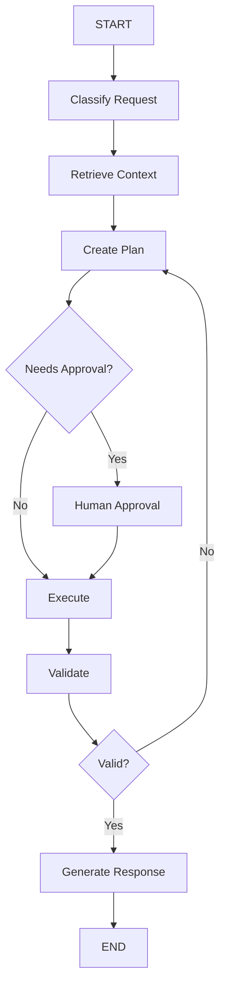

# LangGraph Reference

## 1. Propósito

LangGraph se utiliza para construir workflows y agentes con estado, especialmente cuando se necesitan flujos controlados, ciclos, decisiones condicionales, persistencia, intervención humana y observabilidad.

Este documento sirve como guía práctica para diseñar soluciones con LangGraph.

## 2. Cuándo usar LangGraph

Usar LangGraph cuando:

- El flujo necesita múltiples pasos.
- El agente requiere estado compartido.
- Existen decisiones condicionales.
- Se necesitan ciclos o reintentos.
- Hay intervención humana.
- Se requiere persistencia.
- Se necesita orquestar tools.
- Se necesita trazabilidad.
- Se trabaja con sistemas multiagente.
- Se necesita mayor control que un agente simple.

## 3. Cuándo no usar LangGraph

No usar LangGraph cuando:

- La tarea es una llamada simple al modelo.
- No se requiere estado.
- No existen decisiones condicionales.
- Un script simple resuelve el problema.
- La complejidad del grafo no aporta valor.
- El equipo no está preparado para mantener workflows complejos.

## 4. Conceptos principales

| Concepto | Descripción |
|---|---|
| State | Estado compartido del grafo. |
| Node | Unidad de trabajo. |
| Edge | Conexión entre nodos. |
| Conditional Edge | Ruta dinámica según una condición. |
| Tool | Función externa invocable. |
| Checkpointer | Persistencia del estado. |
| Human-in-the-loop | Punto de aprobación o intervención humana. |
| Subgraph | Grafo reutilizable dentro de otro grafo. |
| Retry | Reintento controlado ante fallos. |
| Streaming | Emisión progresiva de resultados. |

## 5. Diseño del State

El State debe ser explícito y mínimo.

Ejemplo:

```python
from typing import TypedDict, List, Optional

class AgentState(TypedDict):
    user_request: str
    plan: Optional[str]
    files_to_review: List[str]
    findings: List[str]
    final_answer: Optional[str]
    requires_human_approval: bool
```

Buenas prácticas:

- Evitar guardar datos innecesarios.
- Separar entrada, estado intermedio y salida.
- Evitar mezclar datos sensibles.
- Definir tipos claros.
- Documentar cada campo.
- Mantener compatibilidad entre versiones.

## 6. Diseño de Nodes

Cada nodo debe tener una responsabilidad clara.

Ejemplos:

| Nodo | Responsabilidad |
|---|---|
| classify_request | Clasificar intención del usuario. |
| retrieve_context | Recuperar documentos o código. |
| create_plan | Crear plan de acción. |
| execute_tools | Ejecutar herramientas. |
| validate_result | Validar salida. |
| human_approval | Solicitar aprobación humana. |
| generate_response | Crear respuesta final. |

Ejemplo:

```python
def create_plan(state: AgentState) -> AgentState:
    request = state["user_request"]
    # Llamar modelo o lógica de planificación
    state["plan"] = f"Plan para: {request}"
    return state
```

## 7. Diseño de Edges

Los edges definen el flujo.

```text
START -> classify_request -> retrieve_context -> create_plan -> execute_tools -> validate_result -> END
```

## 8. Conditional Edges

Se usan cuando el flujo depende de una decisión.

Ejemplo conceptual:

```python
def route_after_validation(state: AgentState) -> str:
    if state["requires_human_approval"]:
        return "human_approval"
    return "generate_response"
```

## 9. Human-in-the-loop

Usar aprobación humana cuando:

- Se modifican archivos.
- Se ejecutan comandos.
- Se modifican datos.
- Se llama a APIs de escritura.
- Hay riesgo productivo.
- Hay incertidumbre alta.
- Hay impacto financiero o legal.

Puntos típicos:

```text
Plan generado -> Aprobación humana -> Ejecución
Resultado riesgoso -> Aprobación humana -> Publicación
```

## 10. Tools

Toda tool debe documentar:

- Nombre.
- Propósito.
- Parámetros.
- Permisos.
- Errores posibles.
- Riesgos.
- Si requiere aprobación humana.
- Ejemplos.

Ejemplo conceptual:

```python
def read_file(path: str) -> str:
    """Lee un archivo permitido del workspace."""
    pass
```

## 11. Checkpointing

Usar checkpointer cuando:

- El workflow puede durar mucho.
- Se necesita reanudar.
- Hay intervención humana.
- Hay auditoría.
- Se requiere historial del estado.
- El agente tiene memoria de ejecución.

## 12. Manejo de errores

Diseñar errores esperados:

| Error | Estrategia |
|---|---|
| Tool no disponible | Saltar paso o pedir intervención. |
| Entrada inválida | Solicitar corrección. |
| Contexto insuficiente | Recuperar más contexto. |
| Modelo devuelve salida inválida | Reintentar con parser estricto. |
| Riesgo alto | Derivar a humano. |
| Timeout | Reintentar o dividir tarea. |

## 13. Observabilidad

Registrar:

- Estado inicial.
- Nodos ejecutados.
- Decisiones condicionales.
- Tools invocadas.
- Errores.
- Reintentos.
- Tiempo de ejecución.
- Tokens/costo.
- Resultado final.

## 14. Testing

Pruebas mínimas:

- Test de state.
- Test de cada node.
- Test de rutas condicionales.
- Test de errores.
- Test de aprobación humana.
- Test de salida final.
- Test con entradas ambiguas.
- Test con entradas inválidas.

## 15. Plantilla de diseño LangGraph

```markdown
# Diseño LangGraph

## Objetivo

## State

| Campo | Tipo | Descripción |
|---|---|---|

## Nodes

| Node | Responsabilidad | Entrada | Salida |
|---|---|---|---|

## Edges

```text
START -> ...
```

## Conditional Edges

| Condición | Ruta |
|---|---|

## Tools

| Tool | Propósito | Riesgo |
|---|---|---|

## Human-in-the-loop

## Checkpointing

## Errores

## Observabilidad

## Criterios de aceptación
```

## 16. Arquitectura típica



## 17. Recomendación

Usar LangGraph cuando el diseño del agente necesite control explícito del flujo. No usarlo solo por moda. Si el flujo es simple, una chain o un agente básico puede ser suficiente.
