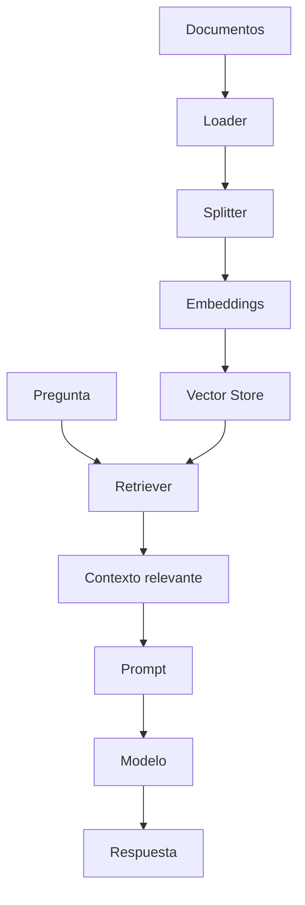

# LangChain Reference

## 1. Propósito

LangChain permite construir aplicaciones basadas en modelos de lenguaje combinando prompts, modelos, retrievers, tools, parsers, chains, agents y memoria.

Este documento sirve como referencia práctica para diseñar soluciones con LangChain.

## 2. Cuándo usar LangChain

Usar LangChain cuando:

- Se necesita conectar un modelo con herramientas externas.
- Se requiere RAG.
- Se necesitan prompts reutilizables.
- Se necesita estructurar chains.
- Se requiere output parsing.
- Se integran múltiples fuentes de datos.
- Se necesita tracing o evaluación.
- Se construyen agentes con tools.

## 3. Cuándo no usar LangChain

No usar LangChain cuando:

- Una llamada directa al modelo es suficiente.
- El framework agrega más complejidad que valor.
- El equipo no necesita abstracciones.
- La solución requiere control de flujo complejo; en ese caso evaluar LangGraph.
- Se quiere minimizar dependencias.

## 4. Componentes principales

| Componente | Descripción |
|---|---|
| Model | Modelo de lenguaje o chat model. |
| PromptTemplate | Plantilla reutilizable de prompt. |
| OutputParser | Parser para estructurar la salida. |
| Retriever | Recupera documentos relevantes. |
| Tool | Función externa invocable por el agente. |
| Chain | Secuencia de pasos. |
| Agent | Componente que decide qué tool usar. |
| Memory | Contexto persistente o conversacional. |
| Embeddings | Representaciones vectoriales. |
| Vector Store | Almacén para búsqueda semántica. |

## 5. Diseño de solución LangChain

Antes de implementar, definir:

- Objetivo.
- Entradas.
- Salidas.
- Modelo.
- Prompt.
- Tools.
- Retriever.
- Memoria.
- Parser.
- Errores esperados.
- Observabilidad.
- Evaluación.
- Despliegue.

## 6. PromptTemplate

Ejemplo conceptual:

```python
from langchain_core.prompts import ChatPromptTemplate

prompt = ChatPromptTemplate.from_messages([
    ("system", "Eres un arquitecto de software experto en .NET y sistemas agénticos."),
    ("human", "Analiza la siguiente propuesta: {proposal}")
])
```

Buenas prácticas:

- Mantener prompts versionados.
- Separar rol, contexto, tarea y formato.
- Definir salida esperada.
- Evitar prompts enormes sin estructura.
- Documentar supuestos.

## 7. Output Parsers

Usar parsers cuando se requiere salida estructurada.

Ejemplo de salida deseada:

```json
{
  "summary": "",
  "risks": [],
  "recommendations": []
}
```

Buenas prácticas:

- Validar JSON.
- Manejar errores de parsing.
- Reintentar con instrucciones más estrictas.
- Usar schemas cuando sea posible.

## 8. RAG

RAG combina recuperación de documentos con generación.

Flujo típico:

```text
Pregunta -> Retriever -> Documentos relevantes -> Prompt con contexto -> Modelo -> Respuesta
```

Componentes:

- Loader.
- Splitter.
- Embeddings.
- Vector Store.
- Retriever.
- Prompt.
- Model.
- Evaluación.

Buenas prácticas:

- Dividir documentos correctamente.
- Guardar metadatos.
- Evitar chunks demasiado grandes.
- Evaluar relevancia de recuperación.
- Citar fuentes cuando aplique.
- No confiar ciegamente en el contexto recuperado.
- Manejar documentos obsoletos.

## 9. Tools

Toda tool debe tener:

- Nombre claro.
- Descripción precisa.
- Parámetros tipados.
- Errores manejados.
- Restricciones.
- Permisos.
- Guardrails.

Ejemplo conceptual:

```python
from langchain_core.tools import tool

@tool
def search_documentation(query: str) -> str:
    """Busca documentación técnica interna relacionada con la consulta."""
    return "resultado"
```

## 10. Agents

Un agente decide qué hacer y qué tool usar.

Usar agentes cuando:

- Hay varias herramientas posibles.
- El camino no es fijo.
- Se requiere razonamiento sobre acciones.
- El usuario puede pedir tareas variadas.

Evitar agentes cuando:

- El flujo es determinístico.
- Una chain simple basta.
- El riesgo de tool misuse es alto.
- No hay guardrails.

## 11. Memory

Tipos de memoria:

| Tipo | Uso | Riesgo |
|---|---|---|
| Buffer | Conversación reciente | Crece mucho. |
| Summary | Resumen de conversación | Puede perder detalles. |
| Vector | Recuperación semántica | Puede traer contexto irrelevante. |
| Entity | Datos de entidades | Puede quedar obsoleta. |

Buenas prácticas:

- Guardar solo lo necesario.
- Separar memoria de usuario, proyecto y ejecución.
- Expirar información obsoleta.
- No guardar secretos.
- Documentar qué se retiene.

## 12. Tracing y evaluación

Registrar:

- Inputs.
- Prompts.
- Modelo usado.
- Tools llamadas.
- Latencia.
- Tokens.
- Salida.
- Errores.
- Feedback.

Evaluar:

- Exactitud.
- Utilidad.
- Seguridad.
- Consistencia.
- Formato.
- Robustez ante entradas ambiguas.

## 13. Plantilla de diseño LangChain

```markdown
# Diseño LangChain

## Objetivo

## Entradas

## Salidas

## Modelo

## Prompt

## Retriever

## Tools

## Chain / Agent

## Memory

## Output Parser

## Error Handling

## Tracing

## Evaluación

## Deployment

## Riesgos

## Criterios de aceptación
```

## 14. Arquitectura RAG conceptual



## 15. Recomendación

Usar LangChain como caja de herramientas para componer soluciones. Usar LangGraph cuando se necesite control explícito de flujo, estado, ciclos o aprobación humana.
