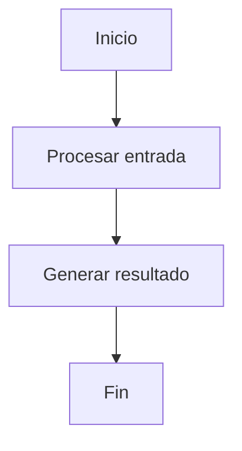

# Documentation Templates

## 1. Objetivo

Proveer plantillas reutilizables para documentar agentes, skills, prompts, tools, workflows, decisiones técnicas y configuraciones.

## 2. Plantilla de agente

```markdown
# Agent: [Nombre]

## Propósito

## Problema que resuelve

## Usuarios objetivo

## Alcance

### Incluye

### No incluye

## Nivel de autonomía

## Responsabilidades

## Entradas

| Entrada | Tipo | Obligatoria | Descripción |
|---|---|---:|---|

## Salidas

| Salida | Tipo | Descripción |
|---|---|---|

## Tools

| Tool | Propósito | Riesgo | Aprobación |
|---|---|---|---|

## Memoria

## Fuentes de conocimiento

## Flujo



## Guardrails

## Seguridad

## Observabilidad

## Costos

## Criterios de aceptación

## Ejemplos

## Prompt del agente

## Configuración

## Riesgos

## Próximos pasos
```

## 3. Plantilla de skill

```markdown
# Skill: [Nombre]

## Objetivo

## Cuándo usarla

## Cuándo no usarla

## Entradas

| Entrada | Tipo | Obligatoria |
|---|---|---:|

## Salidas

| Salida | Tipo |
|---|---|

## Procedimiento

1. 
2. 
3. 

## Restricciones

## Errores comunes

## Ejemplo

## Criterios de aceptación
```

## 4. Plantilla de tool

```markdown
# Tool: [Nombre]

## Propósito

## Tipo

Lectura / Escritura / Ejecución / API externa / Base de datos

## Parámetros

| Parámetro | Tipo | Obligatorio | Descripción |
|---|---|---:|---|

## Respuesta

```json
{
  "success": true,
  "data": {},
  "errors": []
}
```

## Permisos

## Riesgos

## Requiere aprobación humana

Sí / No

## Validaciones

## Manejo de errores

## Logs

## Ejemplos

## Tests mínimos
```

## 5. Plantilla de prompt

```markdown
# Prompt: [Nombre]

## Versión

## Propósito

## Rol

## Contexto

## Objetivo

## Alcance

## Fuera de alcance

## Instrucciones

## Tools disponibles

## Formato de salida

## Guardrails

## Criterios de aceptación

## Prompt final

```text
[Pegar prompt aquí]
```

## Historial de cambios

| Versión | Fecha | Cambio |
|---|---|---|
```

## 6. Plantilla de workflow LangGraph

```markdown
# LangGraph Workflow: [Nombre]

## Objetivo

## State

| Campo | Tipo | Descripción |
|---|---|---|

## Nodes

| Node | Responsabilidad | Entrada | Salida |
|---|---|---|---|

## Edges

```text
START -> ...
```

## Conditional Edges

| Condición | Destino |
|---|---|

## Tools

## Checkpointing

## Human-in-the-loop

## Manejo de errores

## Observabilidad

## Testing

## Riesgos

## Criterios de aceptación
```

## 7. Plantilla ADR

```markdown
# ADR-[Número]: [Título]

## Estado

Propuesta / Aceptada / Rechazada / Obsoleta

## Contexto

## Decisión

## Alternativas consideradas

| Alternativa | Pros | Contras |
|---|---|---|

## Consecuencias

### Positivas

### Negativas

## Riesgos

## Fecha

## Responsables
```

## 8. Plantilla de estándar técnico

```markdown
# Standard: [Nombre]

## Propósito

## Alcance

## Aplica a

## No aplica a

## Reglas

## Ejemplos correctos

## Ejemplos incorrectos

## Checklist

## Excepciones

## Referencias

## Historial de cambios
```

## 9. Plantilla AGENTS.md

```markdown
# AGENTS.md

## Propósito del repositorio

## Stack técnico

## Comandos principales

```bash
dotnet restore
dotnet build
dotnet test
```

## Estructura del proyecto

```text
/src
/tests
/docs
```

## Reglas para agentes

- No modificar archivos fuera del alcance solicitado.
- No tocar secretos.
- No cambiar pipelines sin aprobación.
- No eliminar código sin justificar.
- Mantener estilo existente.
- Ejecutar pruebas cuando sea posible.
- Documentar cambios realizados.

## Estándares de código

## Pruebas

## Seguridad

## Convenciones de commits

## Criterios antes de finalizar

- Build correcto.
- Tests ejecutados.
- Cambios resumidos.
- Riesgos reportados.
```

## 10. Plantilla de revisión de agente

```markdown
# Agent Review

## Agente revisado

## Versión

## Resultado

Aprobado / Aprobado con observaciones / Rechazado

## Hallazgos críticos

## Hallazgos importantes

## Sugerencias

## Riesgos

## Recomendaciones

## Checklist

- [ ] Propósito claro.
- [ ] Alcance definido.
- [ ] Guardrails definidos.
- [ ] Tools documentadas.
- [ ] Manejo de errores.
- [ ] Observabilidad.
- [ ] Seguridad.
- [ ] Criterios de aceptación.
```
